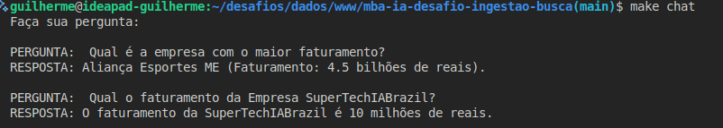

# Desafio MBA Engenharia de Software com IA - Full Cycle

### Pre-requisitos:
- Python 3.10+ [`sudo apt-get install -y python3 python3-pip python3.10-venv`]
- Make (GNU Make ≥ 4.x) [`sudo apt install -y make`]
- Docker (versão ≥ 28.4.0)
- Docker Compose (versão ≥ v2.22.0)
- Chave de API (GEMINI OU OPENAI)
  - Adicionar ao .env OPENAI_API_KEY | Modelo: text-embedding-3-small
  - Adicionar ao .env GOOGLE_API_KEY | Modelo: models/embedding-001

### Como executar:

> `make install`  
> `make up`  
> `make ingest`  
> `make chat`  

> `make help` para ver os comandos disponíveis
>

### Teste de execução

===========================================
#### Requisitos
1. Ingestão do PDF
O PDF deve ser dividido em chunks de 1000 caracteres com overlap de 150.
Cada chunk deve ser convertido em embedding.
Os vetores devem ser armazenados no banco de dados PostgreSQL com pgVector.

2. Consulta via CLI
Criar um script Python para simular um chat no terminal.
Passos ao receber uma pergunta:
Vetorizar a pergunta.
Buscar os 10 resultados mais relevantes (k=10) no banco vetorial.
Montar o prompt e chamar a LLM.
Retornar a resposta ao usuário.

#### Prompt utilizado:
`CONTEXTO:
{resultados concatenados do banco de dados}

REGRAS:
- Responda somente com base no CONTEXTO.
- Se a informação não estiver explicitamente no CONTEXTO, responda:
  "Não tenho informações necessárias para responder sua pergunta."
- Nunca invente ou use conhecimento externo.
- Nunca produza opiniões ou interpretações além do que está escrito.

EXEMPLOS DE PERGUNTAS FORA DO CONTEXTO:
Pergunta: "Qual é a capital da França?"
Resposta: "Não tenho informações necessárias para responder sua pergunta."

Pergunta: "Quantos clientes temos em 2024?"
Resposta: "Não tenho informações necessárias para responder sua pergunta."

Pergunta: "Você acha isso bom ou ruim?"
Resposta: "Não tenho informações necessárias para responder sua pergunta."

PERGUNTA DO USUÁRIO:
{pergunta do usuário}

RESPONDA A "PERGUNTA DO USUÁRIO"`

#### Pacotes recomendados
> **Split**: from langchain_text_splitters import RecursiveCharacterTextSplitter \
> 
> **Embeddings** (OpenAI): from langchain_openai import OpenAIEmbeddings \
> 
> **Embeddings** (Gemini): from langchain_google_genai import GoogleGenerativeAIEmbeddings \
> 
> **PDF**: from langchain_community.document_loaders import PyPDFLoader \
> 
> **Ingestãofrom** langchain_postgres import PGVector \
> 
> **Busca**: similarity_search_with_score(query, k=10) \

#### Estrutura 

├── docker-compose.yml \
├── requirements.txt \
├── .env.example \
├── src/ \
│   ├── ingest.py \
│   ├── search.py \
│   ├── chat.py   \
├── document.pdf  \
└── README.md     \